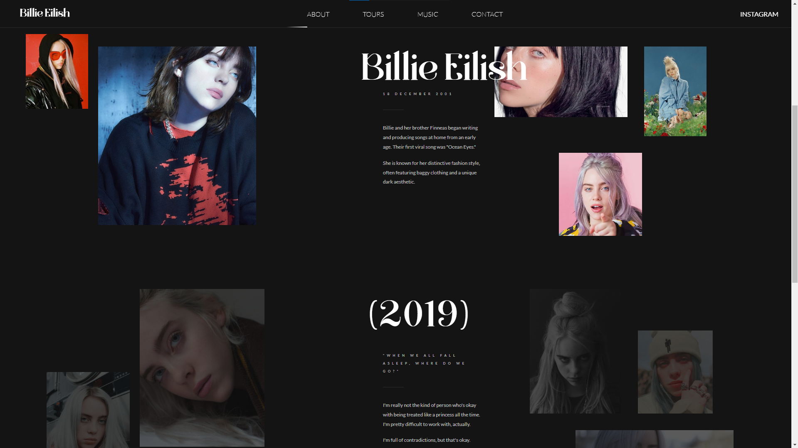

# Billie Eilish App

## Description

This is a web application dedicated to Billie Eilish, showcasing her music, videos, and unique style. The app is built using HTML, CSS, and GSAP for animations, and it provides an immersive experience for fans of Billie Eilish.

## Features

- Interactive user interface showcasing Billie Eilish's music and videos.
- Smooth animations and transitions powered by GSAP (GreenSock Animation Platform).
- User-friendly navigation and intuitive layout.
- Incorporates icons for enhanced visual appeal and user experience.

## Demo

Not deployed.

## Installation

1. Clone this repository: `git clone https://github.com/your-username/billie-eilish-app.git`
2. Navigate to the project directory: `cd billie-eilish-app`
3. Open the `index.html` file in your preferred web browser.

## Usage

- Browse through the different sections to explore Billie Eilish's music and videos.
- Enjoy the smooth animations and interactions powered by GSAP.
- Click on the navigation links to easily navigate between pages.

## Contributing

Contributions are welcome! If you find any issues or have suggestions for improvements, please feel free to open an issue or submit a pull request.

## Credits

- [Billie Eilish Official Website](https://www.billieeilish.com/)
- [GreenSock Animation Platform (GSAP)](https://greensock.com/gsap/)

## License

This project is licensed under the MIT License - see the [LICENSE](LICENSE) file for details.

